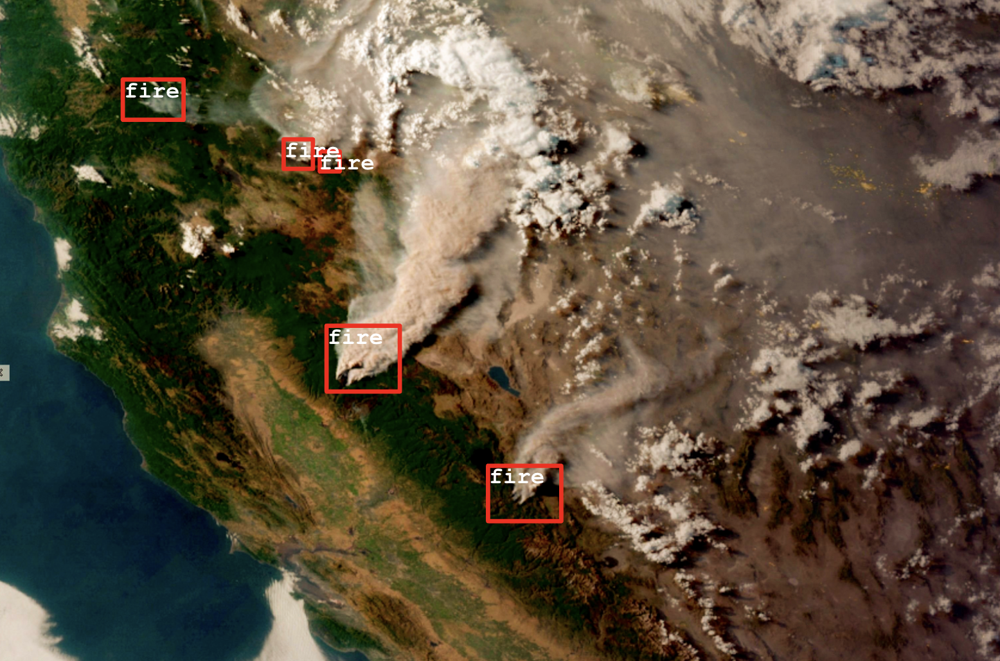
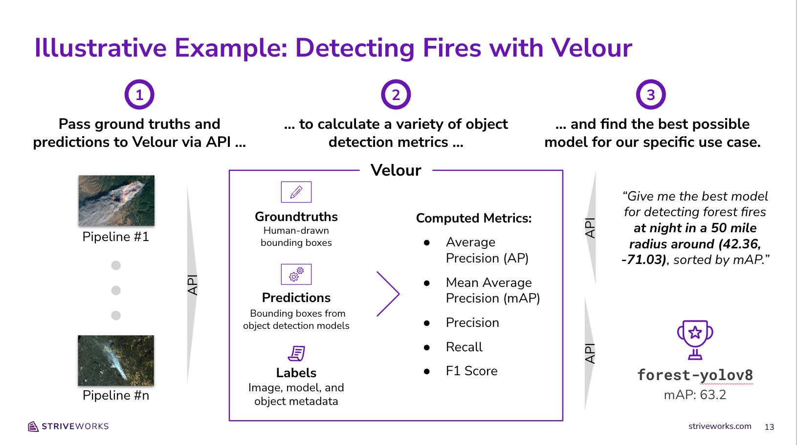

# Introduction

Valor is a centralized evaluation store that makes it easy to measure, explore, and rank model performance. Valor empowers data scientists and engineers to evaluate the performance of their machine learning pipelines and use those evaluations to make better modeling decisions in the future. To skip this textual introduction and dive right in, first go [here](getting_started.md) for instructions to setup the velour service, and then checkout the [sample notebooks](https://github.com/Striveworks/valor/blob/main/examples/).

Valor is maintained by Striveworks, a cutting-edge machine learning operations (MLOps) company based out of Austin, Texas. We'd love to learn more about your interest in Valor and answer any questions you may have; please don't hesitate to reach out to us on [Slack](https://striveworks-public.slack.com/join/shared_invite/zt-1a0jx768y-2J1fffN~b4fXYM8GecvOhA#/shared-invite/email) or [GitHub](https://github.com/striveworks/valor).

These docs are organized as follows:

- **[Overview](index.md)** (this page): Provides an overview of what Valor is, why it's important, and how it works.
- **[Installation](installation.md)**: Explains how to install Valor.
- **[Basic Usage](basic_usage.md)**: Details everything you need to get up and running with using Valor.
- **[Sample Notebooks](https://github.com/Striveworks/valor/blob/main/examples/)**: Collection of descriptive Jupyter notebooks giving examples of how to evaluate model performance using Valor.
- **[Metadata and Filtering](metadata_and_filtering.md)**: Describes Valor's robust support for adding metadata to data, along with how to filter evaluations and Valor objects based on metadata and other attributes.
- **[Metrics](https://striveworks.github.io/valor/metrics)**: Describes all of the metrics that you can calculate using Valor.
- **[Endpoints](endpoints.md)**: Documents Valor's various API endpoints.
- **[Technical Concepts](technical_concepts.md)**: Describes the technical concepts that underpin Valor.
- **[Contributing and Development](contributing.md)**: Explains how you can build on and contribute to Valor.
- **[Python Client API](client_api/Client.md)**: Shares reference documentation for our Python client.

# Overview

In this section, we'll explore what Valor is, why it's important, and provide a high-level description of how it works. This overview is also available in the following five-minute video:

<div style="position: relative; width: 100%; height: 0; padding-bottom: 56%;">
  <iframe style="position: absolute; width: 100%; height: 100%; left: 0; top: 0;" src="https://www.youtube.com/embed/SbJtZ9osFkg?si=P4SLqdspuTJ0sXbb" title="YouTube video player" frameborder="0" allow="accelerometer; autoplay; clipboard-write; encrypted-media; gyroscope; picture-in-picture; web-share" allowfullscreen></iframe>
</div>

# Use Cases for a Containerized Evaluation Store

As we've worked with dozens of data scientists and engineers on their MLOps pipelines, we have identified three important questions that an effective evaluation store could help them answer. First, they wanted to understand: **"Of the various models I tested for a given dataset, which one performs best?"**. This is a very common and important use case—and one that is often solved on a model-to-model basis in a local Jupyter notebook. This focus on bespoke implementations limits traceability and makes it difficult to create apples-to-apples comparisons between new model runs and prior model runs.

Second, our users wanted to understand: **"How does the performance of a particular model vary across datasets?"**. We found that many practitioners use the same computer vision model (e.g., YOLOv8) for a variety of supervised learning tasks, and they needed a way to identify patterns where that particular model didn't meet expectations.

Finally, our users wanted to understand: **"How can I use my prior evaluations to pick the best model for a future ML pipeline?"**. This last question requires the ability to filter previous evaluations on granular metadata (e.g., time of day, geospatial coordinates, etc.) in order to provide tailored recommendations regarding which model to pick in the future.

With these three use cases in mind, we set out to build a centralized evaluation store that we later named Valor.

# Introducing Valor

Valor is a centralized evaluation store that makes it easy to measure, explore, and rank model performance. Our ultimate goal with Valor is to help data scientists and engineers pick the right ML model for their specific needs. To that end, we built Valor with three design principles in mind:

- **Valor works with any dataset or model:** We believe Valor should be able to handle any supervised learning task that you want to throw at it. Just pass in your ground truth annotations and predictions, describe your learning task (i.e., object detection), and Valor will do the rest. (Note: At launch, Valor will only support classification and computer vision (i.e., image segmentation and object detection) tasks. We're confident this framework will abstract well to other supervised learning tasks and plan to support them in later releases).
- **Valor can handle any type of image, model, or dataset metadata you throw at it:** Metadata is a critical component of any evaluation store as it enables the system to offer tailored model recommendations based on a user's specific needs. To that end, we built Valor to handle any metadata under the sun. Dates, geospatial coordinates, and even JSONs filled with configuration details are all on the table. This means you can slice and dice your evaluations any way you want: just pass in the right labels for your use case and define your filter (say a geographic bounding box), and you’ll get back results for your specific needs.
- **Valor standardizes the evaluation process:** The trickiest part of comparing two different model runs is avoiding apples-to-oranges comparisons. Valor helps you audit your metrics and avoid false comparisons by versioning your uploads, storing them in a centralized location, and ensuring that you only compare runs that used the exact same filters and metrics.

# How It Works: An Illustrative Example

Let’s walk through a quick example to bring Valor to life.

Say that you're interested in using computer vision models to detect forest fires around the world using satellite imagery. You've just been tasked with building a new ML pipeline to detect fires in an unfamiliar region of interest. How might you leverage your evaluation metrics from prior ML pipelines to understand which model will perform best for this particular use case?



To answer this question, we'll start by passing in three pieces of information from each of our prior modeling runs:

- **GroundTruths:** First, we'll pass in human-annotated bounding boxes to tell Valor exactly where forest fires can be found across all of the satellite images used in prior runs.
- **Predictions:** Next, we'll pass machine-generated predictions for each image (also in the form of bounding boxes) so that Valor can evaluate how well each model did at predicting forest fires.
- **Labels:** Finally, we'll pass metadata to Valor describing each of our various images (e.g., the time of day the photo was taken, the geospatial coordinates of the forest in the photo, etc.). We'll use this metadata later on in order to identify the right model for our new use case.

Once we pass in these three ingredients, Valor will compare all of our `GroundTruths` and `Predictions` in order to calculate various evaluation metrics (i.e., mean average precision or mAP). These metrics, `Labels`, `GroundTruths`, and `Predictions`, will all be stored in Postgres, with PostGIS support for fast geospatial lookups and geometric comparisons at a later date.

Finally, once all of our previous pipeline runs and evaluations are stored in Valor, we can use Valor’s API to specify our exact filter criteria and get back its model rankings. In this case, we can ask Valor to find us the best model for detecting forest fires at night in a 50 mile radius around (42.36, -71.03), sorted by mAP. Valor will then filter all of our stored evaluation metrics, rank each model with evaluations that meet our criteria, and send back all relevant evaluation metrics to help us determine which model to use for our new modeling pipeline.



# Next Steps

To get started with Valor, we'd recommend reviewing our [sample notebooks](https://github.com/Striveworks/valor/blob/main/examples/getting_started.ipynb) or reading our [Getting Started docs](getting_started.md). For more detailed explanations of Valor's technical underpinnings, see our [technical concepts guide](technical_concepts.md).

# FAQ

**Q. What is Valor?**

**A.** Valor is a centralized evaluation store that makes it easy to measure, explore, and rank model performance. For an overview of what Valor is and why it's important, please refer to our [high-level overview](index.md).

**Q. What evaluation methods are supported?**

**A.** Valor currently supports generic classification as well as object-detection and semantic-segmentation for images. The long-term goal for Valor is to support the most popular supervised learning methods.

**Q. Does Valor store data?**

**A.** Valor only stores ground truth annotations, model predictions, and user-defined metadata.

**Q. What is a Datum?**

**A.** A `valor.Datum` object is a generic type that represents a datum in the context of a machine learning workflow. The object stores a UID and related metadata in a dictionary. This metadata allows for the user to construct their own abstraction layer by mapping a real-world type (e.g., an image) into a `valor.Datum` type.

```python
from valor.metatypes import ImageMetadata
image = ImageMetadata(
  uid = "1234",
  height = 100,
  width = 100,
)

# convert metatype to datum
datum = image.to_datum()
```

**Q. What is a GroundTruth?**

**A.** `valor.GroundTruth` objects in Valor each represent a singular datum and its associated annotations that provide a reference standard or the 'truth' against which predictions are compared. There cannot be multiple ground truths per datum.

**Q. What is a Prediction?**

**A.** `valor.Prediction` objects are similar to `valor.GroundTruth` objects in that they also contain a list of annotations over a datum. However, these annotations are generated by a model as inferences, and the object also includes the name of the model that was used for creating these inferences. There cannot be multiple predictions by the same model over a single datum.

**Q. Can Valor handle multiple data types?**

**A.** Valor abstracts data types through metadata. An example of this can be seen in `valor.metatypes.ImageMetadata` which describes the mapping of an image to a `valor.Datum`.

# Troubleshooting

**Q. Why am I getting `NotFinalizedError` when trying to run an evaluation?**

**A.** Valor requires both dataset and model representations to be finalized before evaluation can take place. Finalization is crucial for auditability as it ensures that data finalized at a certain date is immutable.

Dataset finalization is accomplished through the `valor.Dataset.finalize` member function.

```python
from valor import Client, Dataset
client = Client(...)
dataset = Dataset(name="test_dataset")
...
dataset.finalize()
```

Models are finalized automatically given two conditions.

1. The working dataset is finalized.
1. There is a 1:1 mapping of predictions to ground truths.

Models and their predictions can also be finalized prematurely using the `valor.Model.finalize_inferences` member function. This will generate empty predictions with task type `enums.TaskType.SKIP` to achieve the 1:1 ground truth mapping.

```python
from valor import Client, Dataset, Model
client = Client(...)
dataset = Dataset(name="test_dataset")
model = Model(name="test_model")
...
dataset.finalize()
model.finalize_inferences(dataset)
```

**Q. Why am I getting GDAL driver errors?**

**A.** For some computations (mostly involving rasters), Valor requires the PostGIS database to have all GDAL drivers enabled. The Valor back end attempts to enable these drivers, but it might not have permission depending on your specific setup. If you encounter this error, [see here](https://postgis.net/docs/postgis_gdal_enabled_drivers.html) for ways to enable the drivers directly in the PostGIS instance.
